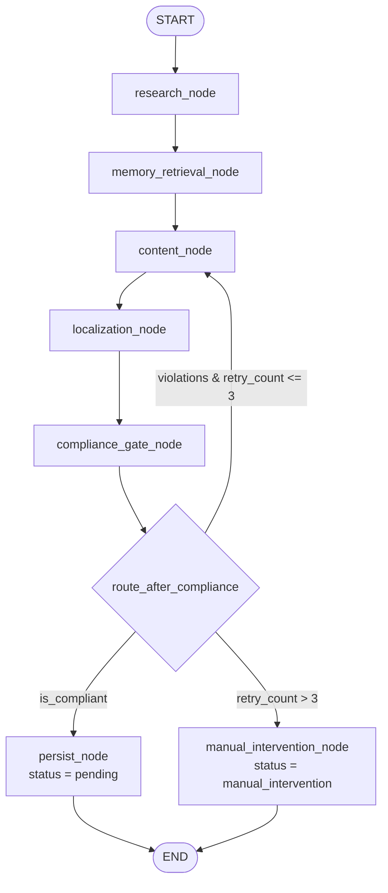

# CLAUDE.md — JA Assure AI Marketing System

Operating manual for any AI agent or engineer working in this repository.
**Read this file in full before making changes.** It is the single source of
architectural truth. `PLAN.md` tracks execution state and must be updated as
work completes.

---

## 1. Mission

Build an end-to-end, **code-based** multi-agent marketing system for **JA Assure**,
a Singapore-based niche InsurTech, for the JA Assure Hackathon.

### Brands — distinct voices, never blend them

| Brand | Line of business | Voice |
| --- | --- | --- |
| **Jade** | Jewellers block insurance | Craft, heritage, discretion; speaks to high-net-worth retailers |
| **Jaguar Transit** | High-value goods transit | Logistics precision, risk control, operational B2B |
| **DoctorShield** | Medical indemnity | Clinical, calm, authoritative; peer-to-peer with clinicians |

### Markets and languages

Singapore, Malaysia, Hong Kong, Indonesia, Thailand →
English (`en`), Malay (`ms`), Bahasa Indonesia (`id`), Thai (`th`), Chinese (`zh`).

### Two deliverables

- **Project 1 — The Brain (required).** Research → content → localisation →
  compliance → human approval → approved queue.
- **Project 2 — The Hands (bonus).** A background worker publishes the approved queue.

They connect through **one shared database table**, `content_queue`. Project 1
writes to it; Project 2 reads from it. **Project 1 must be complete and demoable
even if Project 2 is never built.**

> **Non-negotiable:** nothing becomes publish-ready without a human approving it.

---

## 2. Git policy — STRICT

1. **NEVER co-author a commit.** Do not add `Co-authored-by:` trailers, do not add
   "Generated with" footers, tool attribution, emoji signatures, or any other
   trailer identifying an AI. Every commit is attributed **solely to the
   repository owner**.
2. Commit messages use Conventional Commits — subject line plus optional body,
   nothing else:

   ```
   feat(graph): add compliance retry cycle with circuit breaker

   Routes compliance failures back to the content agent and diverts to the
   manual_intervention queue once retry_count exceeds 3.
   ```

3. You **may** create branches, push them, and open pull requests using the `gh` CLI.
4. **Never commit secrets.** `.env` is git-ignored; only `.env.example` (empty values)
   is tracked. Secrets live in environment variables — a hard hackathon rule.
5. Never force-push `main`. Never rewrite published history.
6. Never commit generated media (`assets/generated/`), databases (`*.db`), or virtualenvs.
7. Ask before `git rm`, `git reset --hard`, or anything destructive.

---

## 3. Branching strategy

`main` is always demoable. All work happens on feature branches merged back via PR.

```
main
 ├── feature/core-graph        # LangGraph state machine + agents
 ├── feature/memory-engine     # closed-loop feedback retrieval + injection
 ├── feature/review-ui         # human approval dashboard
 ├── feature/video-pipeline    # edge-tts + moviepy assembly
 ├── feature/lead-gen          # scraping, enrichment, scoring
 └── feature/auto-publisher    # Project 2 background worker
```

One branch per phase. Rebase on `main` before opening the PR. Squash-merge.

---

## 4. Architecture — state machine orchestration (LangGraph)

### The rule

**Do not use linear API chains.** The pipeline is a **cyclic state machine**. A
linear chain cannot express "compliance failed, go back and rewrite" — that cycle
is the core of this system and the thing judges will look for.

### State definition

`app/graph/state.py` — a single `TypedDict` threaded through every node:

```python
class MarketingState(TypedDict):
    # --- required core fields ---
    draft_content: str          # the working copy, rewritten on each retry
    brand: str                  # "Jade" | "Jaguar Transit" | "DoctorShield"
    platform: str               # "linkedin" | "instagram" | "x" | "tiktok" | "blog"
    language: str               # "en" | "ms" | "id" | "th" | "zh"
    compliance_errors: list[str]  # violations from the most recent gate run
    retry_count: int            # incremented on every failed compliance pass

    # --- additive context ---
    topic: str                  # the seed idea / research hook
    content_type: str           # "post" | "carousel" | "reel" | "thread" | "blog"
    research_notes: str         # competitor / market intel for this run
    feedback_guidance: str      # injected lessons-learned block (see section 5)
    media_path: str | None      # assembled video/image asset, if any
    status: str                 # terminal status written to content_queue
    content_id: int | None      # row id once persisted
```

### Graph topology



### Node contracts

| Node | Reads from state | Writes to state |
| --- | --- | --- |
| `research_node` | `brand`, `topic` | `research_notes` |
| `memory_retrieval_node` | `brand`, `platform` | `feedback_guidance` |
| `content_node` | `brand`, `platform`, `content_type`, `research_notes`, `feedback_guidance`, `compliance_errors` | `draft_content` |
| `localization_node` | `draft_content`, `language`, `brand` | `draft_content` (localised in place) |
| `compliance_gate_node` | `draft_content`, `brand` | `compliance_errors`, `retry_count` |
| `persist_node` | all | `content_id`, `status` |
| `manual_intervention_node` | all | `content_id`, `status` |

### Cyclic routing and the circuit breaker

`route_after_compliance` is a conditional edge, and it is the only place retry
policy lives:

```python
MAX_RETRIES = 3

def route_after_compliance(state: MarketingState) -> str:
    if not state["compliance_errors"]:
        return "persist"
    if state["retry_count"] > MAX_RETRIES:
        return "manual_intervention"     # circuit breaker
    return "content"                     # cycle back and rewrite
```

**Rules:**

- `retry_count` is incremented by `compliance_gate_node` on every failure, never
  anywhere else.
- When the graph cycles back to `content_node`, the previous `compliance_errors`
  **must** be injected into the rewrite prompt. Retrying with an identical prompt
  is a bug — the agent has to be told what it got wrong.
- `retry_count > 3` routes to `manual_intervention`, which persists the row with
  `status = "manual_intervention"` and the full violation history. **The graph
  never loops forever and never crashes on a stubborn draft.**
- Compile the graph with a checkpointer so a run is resumable and inspectable.

---

## 5. Closed-loop memory engine — the key differentiator

This is what makes the system measurably improve. Treat it as first-class.

### Store

Table `feedback_memory` (see `app/db/models.py`):

| Column | Type | Notes |
| --- | --- | --- |
| `id` | int PK | |
| `brand` | str | indexed with `platform` |
| `platform` | str | |
| `error_tag` | str | short controlled tag: `too_salesy`, `inaccurate_claim`, `off_brand_tone`, `wrong_cta`, `compliance_risk`, `poor_localisation` |
| `human_note` | text | the reviewer's free-text reason |
| `timestamp` | datetime | defaults to now, descending index |
| `content_id` | int FK, nullable | *additive* — traceability back to the rejected row |

Every human **reject or edit** in the review dashboard writes a row here. That is
the only way rows are created — the loop is closed by humans, not by the model.

### Retrieval — runs BEFORE generation, every time

`memory_retrieval_node` executes before `content_node`:

```sql
SELECT error_tag, human_note
FROM feedback_memory
WHERE brand = :brand AND platform = :platform
ORDER BY timestamp DESC
LIMIT 5;
```

### Injection — exact prompt contract

The retrieved notes are formatted and injected into the content agent's **system
prompt** (not the user turn) as:

```
CRITICAL GUIDANCE: Previously, human reviewers rejected content for this brand
due to: {fetched_notes}. You MUST NOT repeat these mistakes.
```

If there is no feedback yet, inject nothing — never inject an empty or placeholder
guidance block.

### Proving it works

Track and surface on the dashboard: rejection rate over time, average retries per
asset, and edit distance between `draft_content` and `final_content`. A downward
trend in all three is the evidence that the loop is learning.

---

## 6. Compliance gate — a first-class agent, not an afterthought

Insurance marketing is regulated. Certain coverage claims and guarantees are
illegal. **Every asset is gated before it can enter the queue.**

### Structured output is mandatory

The judge must return machine-parseable JSON, enforced at the API level
(`response_format` / `response_schema` — never "please reply in JSON"):

```json
{ "is_compliant": true, "violations": [] }
```

```json
{
  "is_compliant": false,
  "violations": [
    "Uses the word 'guaranteed' about claim payouts (Rubric 2.1)",
    "States a coverage limit without the policy-terms qualifier (Rubric 3.4)"
  ]
}
```

The schema is exactly `{"is_compliant": boolean, "violations": ["string"]}`. Any
other shape is a hard failure — do not attempt to salvage it by regex.

### Grounding

The agent is grounded in `compliance_rubric.md`, **loaded from disk at runtime**
and inserted into the system prompt. Rules are never hardcoded in Python — the
compliance team has to be able to edit the rubric without touching code.

Each violation string should cite the rubric clause it breaches, so the content
agent gets an actionable correction on the retry cycle.

### Temperature

Run the judge at temperature 0. Creativity is a defect in a compliance check.

---

## 7. Localisation layer

**No translation API.** Rely entirely on the LLM's native multilingual ability.

`localization_node` is a dedicated LangGraph node that branches on the `language`
state variable:

| Code | Language | Market |
| --- | --- | --- |
| `en` | English | Singapore / Hong Kong |
| `ms` | Malay | Malaysia |
| `id` | Bahasa Indonesia | Indonesia |
| `th` | Thai | Thailand |
| `zh` | Chinese | Singapore / Hong Kong |

**Adapt, do not translate.** The prompt instructs the model to carry over intent
and persuasive effect while adapting tone, idiom, formality register, and cultural
nuance to the target market. Literal translation is a failure mode — a Malay
LinkedIn post for insurance brokers should read as though it were written in Malay
by a local marketer, not rendered from English.

Rules:

- When `language == "en"`, the node still runs a light regional pass (Singapore/HK
  English conventions) rather than being skipped.
- Preserve brand names, product names and regulatory qualifiers verbatim.
- Localise the CTA, not just the body — CTA conventions differ sharply by market.
- Localisation runs **before** the compliance gate, so the gate judges the text
  that will actually be published.

---

## 8. Zero-cost video assembly pipeline

Built natively in Python. **No paid video APIs, ever.**

```
script (LLM) → edge-tts → voiceover.mp3 → moviepy: VideoFileClip + set_audio → reel.mp4
```

1. The content agent produces a short spoken script alongside the caption.
2. `edge-tts` synthesises the voiceover to MP3 — free, no API key, and it has
   usable neural voices for every one of our five languages. Pick the voice from
   the `language` state variable.
3. `moviepy` loads a background clip from `assets/video/` as a `VideoFileClip`,
   attaches the MP3 with `.set_audio(...)`, trims the video to the audio duration,
   and writes the MP4 to `assets/generated/`.
4. The output path is written to `content_queue.media_path`.

> **Pinned dependency — do not "upgrade" this.** `moviepy` is pinned to `<2.0`.
> MoviePy 2.x renamed the setter API (`set_audio` → `with_audio`, `set_duration` →
> `with_duration`). The 1.x API specified here is what the code targets. If you
> ever move to 2.x, every `set_*` call must change in the same commit.

`ffmpeg` must be on `PATH`; moviepy shells out to it.

---

## 9. Tech stack — decisions of record

| Concern | Choice | Why |
| --- | --- | --- |
| Backend | Python 3.10+, FastAPI | Async, serves both the API and the review UI |
| Orchestration | **LangGraph** | Cyclic state machine with checkpointing — the requirement |
| LLM | Gemini (Flash) by default, provider-agnostic adapter | Free tier per the brief; `app/llm/client.py` abstracts Gemini and OpenAI behind one `structured_call()` |
| Database | SQLAlchemy over SQLite (dev) → PostgreSQL (demo) | One `DATABASE_URL`; no code change to switch |
| Review UI | FastAPI + Jinja2 + HTMX | Server-rendered, no build step, single process to demo |
| Voiceover | `edge-tts` | Free, multilingual, no key |
| Video | `moviepy` (<2.0) + `ffmpeg` | Free local assembly |
| Research / scraping | ScrapeGraphAI or Crawl4AI | LLM-driven, resilient to selector churn |
| Scheduler (Project 2) | APScheduler | In-process, no broker needed |
| Publishing (Project 2) | Buffer or Ayrshare API | Free tier, real posting |

**Cost rule:** free tiers only. If a task appears to need a paid API, stop and
raise it rather than silently adding cost.

---

## 10. Repository layout

```
.
├── CLAUDE.md                 # this file — rules and architecture
├── PLAN.md                   # phased execution tracker (keep current)
├── compliance_rubric.md      # regulatory rules, loaded at runtime by the gate
├── .env.example              # every required variable, empty values
├── requirements.txt
├── app/
│   ├── main.py               # FastAPI entrypoint
│   ├── config.py             # pydantic-settings, env-driven
│   ├── api/                  # REST routes
│   ├── db/                   # engine, session, models
│   ├── graph/                # LangGraph state, nodes, routing  (Phase 2)
│   ├── agents/               # prompts and agent logic          (Phase 2)
│   ├── memory/               # feedback retrieval and injection (Phase 3)
│   ├── media/                # edge-tts + moviepy pipeline      (Phase 4)
│   ├── leads/                # scraping, enrichment, scoring    (Phase 5)
│   ├── llm/                  # provider-agnostic LLM client
│   ├── templates/            # Jinja2 review dashboard          (Phase 6)
│   └── static/
├── worker/                   # Project 2 auto-publisher         (Phase 7)
├── assets/video/             # background clips (tracked)
├── assets/generated/         # rendered output (git-ignored)
├── scripts/                  # init_db, seed_demo
└── tests/
```

---

## 11. Workflow rules

1. **Read `PLAN.md` before starting any step. Update it the moment a step is
   done** — tick the box, add a one-line note on what landed. The plan is the
   shared state between sessions; a stale plan is worse than none.
2. One phase per feature branch. Do not start a phase whose dependencies are
   not ticked.
3. Every phase ends with something that **actually runs**. Judges score a working
   prototype demoed live, not slides. No phase is "done" because the code was
   written — it is done when it executes.
4. Never hardcode a secret, an API key, a database URL, or a brand rule.
5. Prefer small, working increments over large, unverified ones.
6. When the brief and a local preference conflict, the brief wins — and flag it.

## 12. Coding standards

- Type hints everywhere; `TypedDict` for graph state, Pydantic for API contracts.
- Every LLM call goes through `app/llm/client.py` — no direct SDK calls in nodes.
- Every database access goes through a session dependency — no ad-hoc connections.
- Prompts live in `app/agents/prompts.py`, not inline in node functions.
- Log every state transition with `content_id`, `retry_count`, and the node name;
  the graph's behaviour must be legible from the logs during a live demo.
- Fail loudly in development, degrade gracefully in the demo path.
