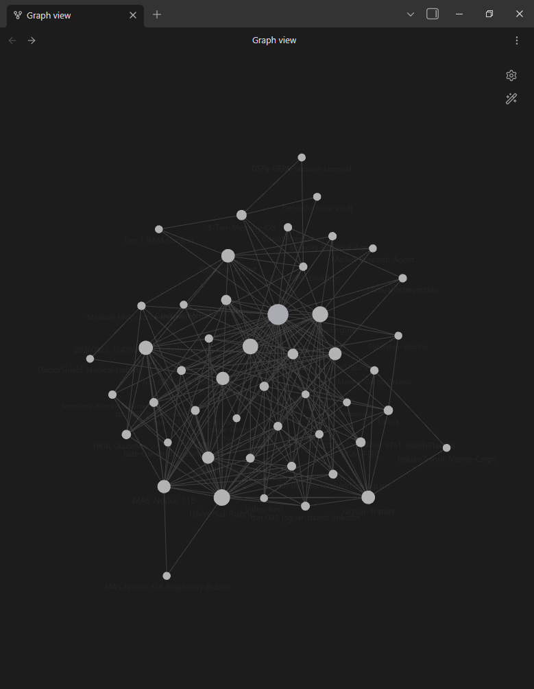
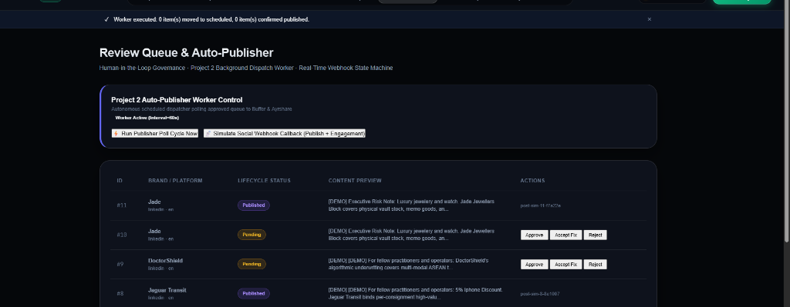
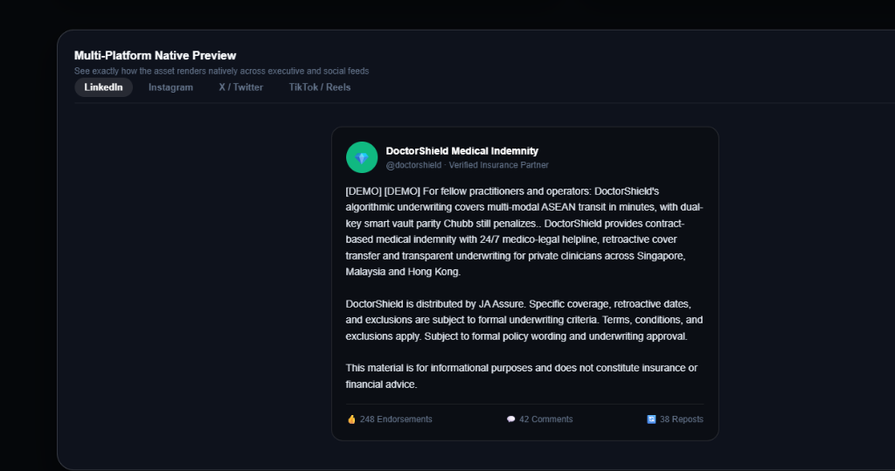
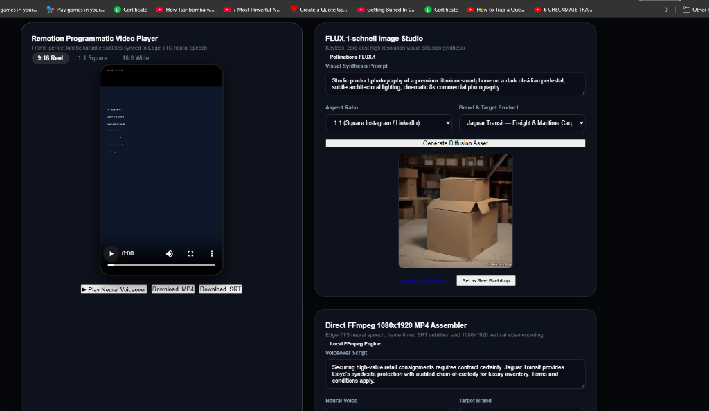
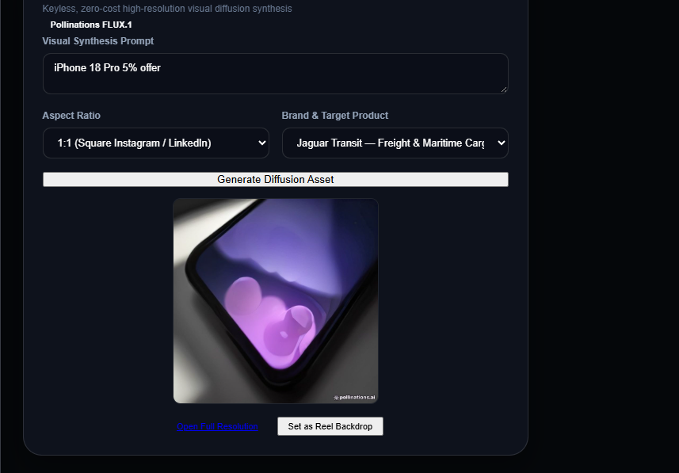
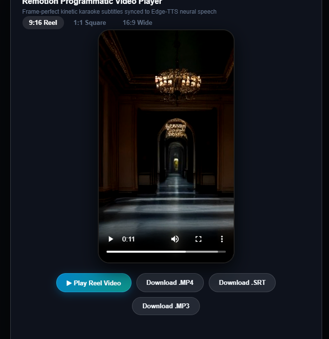
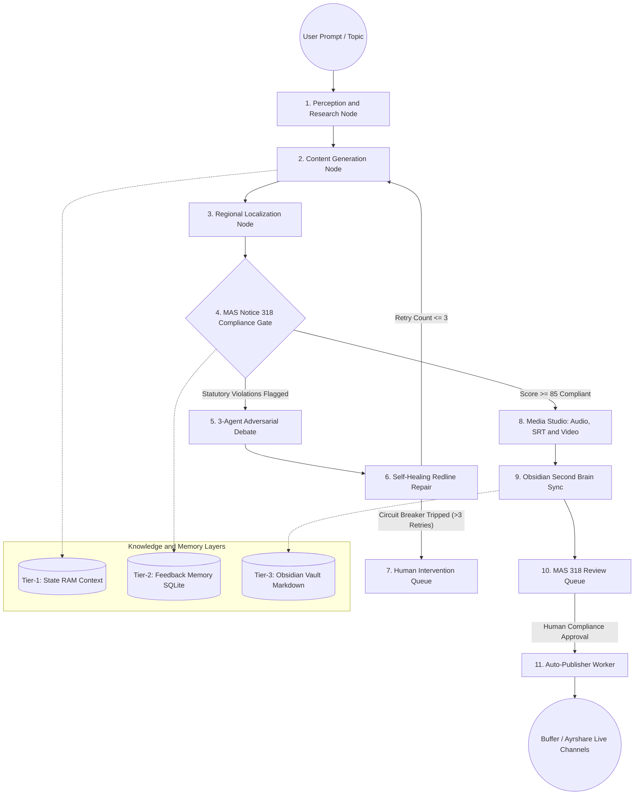

# JA Assure — Autonomous Multi-Agent Marketing and Self-Healing Compliance OS

<p align="left">
  <a href="https://github.com/prarabdha7/GCICI26"></a>
  
  
  
  
  
  
  
  
  
</p>

> **Repository**: [https://github.com/prarabdha7/GCICI26](https://github.com/prarabdha7/GCICI26)

**JA Assure Intelligence OS** is an autonomous enterprise marketing system engineered for **JA Assure** — a Singapore-headquartered niche InsurTech managing high-value risk portfolios across South East Asia and Hong Kong. It combines a cyclic LangGraph state machine, a 3-tier cognitive memory architecture, real-time competitive intelligence, deterministic statutory compliance auditing (MAS Notice 318), and a zero-cost programmatic media rendering studio (FFmpeg, Edge-TTS, FLUX.1).

Three distinct risk brands are supported out of the box:

- **Jade Assure**: Jewellers Block, fine horology, and dual-key high-value vault coverage.
- **Jaguar Transit**: Armored attended cargo, cold-chain maritime, and high-consequence logistics transit.
- **DoctorShield**: Specialist medical malpractice indemnity and clinical dispute arbitration.

---

## Table of Contents

- [1. Repository Structure](#1-repository-structure)
- [2. Visual Interface and Architecture Showcase](#2-visual-interface-and-architecture-showcase)
- [3. End-to-End System Architecture](#3-end-to-end-system-architecture)
- [4. Step-by-Step Cognitive Agentic Pipeline](#4-step-by-step-cognitive-agentic-pipeline)
- [5. Obsidian Second Brain and 3-Tier Memory OS](#5-obsidian-second-brain-and-3-tier-memory-os)
- [6. Zero-Cost Media Studio and FFmpeg Reel Pipeline](#6-zero-cost-media-studio-and-ffmpeg-reel-pipeline)
- [7. Computational Complexity and Latency Matrix](#7-computational-complexity-and-latency-matrix)
- [8. Deterministic Statutory Compliance Benchmarks](#8-deterministic-statutory-compliance-benchmarks)
- [9. Local Development and Reproducibility Guide](#9-local-development-and-reproducibility-guide)
- [10. Architectural Decisions and Engineering Justifications](#10-architectural-decisions-and-engineering-justifications)

---

## 1. Repository Structure

The codebase is organized into modular layers separating state-machine orchestration, compliance auditing, media assembly, and the Apple Design Method presentation layer:

```
GCICI/
├── app/
│   ├── main.py                     # Primary FastAPI application, middleware and unified mounting
│   ├── config.py                   # Pydantic Settings with strict validation and .env resolution
│   ├── agents/
│   │   ├── brand_knowledge.py      # Underwriting criteria, warranties and brand rubrics
│   │   ├── formats.py              # Multi-channel formatting (LinkedIn, IG, X, TikTok, Focus Group)
│   │   ├── inquisitor.py           # Adversarial compliance evaluator and 3-agent debate
│   │   ├── leads.py                # B2B prospecting and underwriting fit-score algorithm
│   │   ├── prompts.py              # Zero-shot and few-shot system prompts with memory injection
│   │   └── providers.py            # Unified LLM provider interface (Gemini / OpenAI)
│   ├── api/
│   │   ├── actions.py              # Core JSON actions API for media, perception and compliance
│   │   └── dashboard.py            # Legacy server-side review dashboard and telemetry endpoints
│   ├── db/
│   │   ├── database.py             # SQLAlchemy engine, sessionmaker and SQLite/Postgres scopes
│   │   └── models.py               # ContentQueue, FeedbackMemory, LeadEntry ORM schemas
│   ├── graph/
│   │   ├── nodes.py                # Discrete LangGraph nodes: research, draft, localize, audit
│   │   ├── routing.py              # Edge routing logic for the compliance and localization gates
│   │   ├── graph.py                # Graph assembly: node wiring, edge routing, compilation
│   │   └── state.py                # TypedDict MarketingState carrying cumulative run context
│   ├── integrations/
│   │   └── obsidian.py             # Bidirectional Second Brain Markdown and Excalidraw exporter
│   ├── llm/
│   │   ├── client.py               # Provider-agnostic client with automatic rate-limit cascading
│   │   └── fallback.py             # Domain-grounded heuristic fallback and self-healing engine
│   ├── media/
│   │   ├── assembly.py             # Direct FFmpeg 1080x1920 encoder and timed SRT subtitle burn-in
│   │   ├── image_gen.py            # FLUX.1 visual synthesis and brand color grading
│   │   └── stock_video.py          # Semantic stock footage selector and fallback video provider
│   └── utils/
│       └── research.py             # Live Tavily, Serper and Crawl4AI competitor intelligence scraper
├── frontend/
│   ├── index.html                  # Apple Keynote UI shell and Cupertino viewport container
│   ├── app.js                      # Reactive SPA controller (10 views, audio visualizer, scrub)
│   └── styles.css                  # Apple Design Method design tokens, glassmorphism and typography
├── worker/
│   ├── publisher.py                # Buffer / Ayrshare social dispatcher and webhook handler
│   └── scheduler.py                # APScheduler daemon polling approved queue under MAS Notice 318
├── scripts/
│   ├── sync_obsidian_vault.py      # Second Brain vault synchronization and bidirectional linker
│   ├── init_db.py                  # DDL table creation and schema initialization
│   └── seed_demo.py                # Walkthrough seed data generator for keyless testing
├── docs/
│   └── images/                     # Architectural diagrams, UI mockups and knowledge graph captures
├── tests/                          # 182 comprehensive unit, integration and compliance tests
├── run.py                          # Unified server runner (spawns API + background workers)
├── GITHUB_REPO.txt                 # Canonical repository URL
└── requirements.txt                # Pinned production dependencies
```

---

## 2. Visual Interface and Architecture Showcase

The frontend is constructed following the **Apple Design Method (ADM)** — featuring cinematic typography, frosted glassmorphic cards (`backdrop-filter: blur(20px)`), an Apple Keynote boot loader, live audio waveform visualizers, and interactive playhead scrubbers.

| **Obsidian Second Brain Knowledge Graph** | **Zero-Cost Media Studio and Remotion Player** |
|:---:|:---:|
| <a href="docs/images/obsidian_vault_graph.png"></a> | <a href="docs/images/zero_cost_media_studio.png"></a> |
| *Topological graph mapping brands, underwriting constraints and MAS 318 rules.* | *Remotion programmatic player, 28-bar waveform and FLUX.1 diffusion.* |

| **MAS Notice 318 Compliance and Self-Healing** | **Real-Time Competitor Perception Engine** |
|:---:|:---:|
| <a href="docs/images/compliance_self_healing.png"></a> | <a href="docs/images/perception_engine_scraper.png"></a> |
| *Statutory audit, 3-agent adversarial debate and automatic redline repair.* | *Live NLP scraping of competitor policies, policy UINs and counter-hooks.* |

| **Review Queue and Auto-Publisher Worker** | **1080x1920 MP4 Video Reel with Burned Subtitles** |
|:---:|:---:|
| <a href="docs/images/review_queue_publisher.png"></a> | <a href="docs/images/remotion_video_player.png"></a> |
| *MAS Notice 318 Human-in-the-Loop gate with 1-click dispatch.* | *Cinematic AI camera motion (Ken Burns zoompan) with burned captions.* |

---

## 3. End-to-End System Architecture

The core pipeline operates as a cyclic directed state machine orchestrated with **LangGraph**. A draft cannot advance to publishing without successfully passing through the statutory compliance gate.



---

## 4. Step-by-Step Cognitive Agentic Pipeline

### Phase 1: Live Market Perception and Competitor Scraping

- **Action**: Queries live web indices using **Tavily Neural Search** and **Google Serper**, followed by direct DOM parsing via `httpx` and `BeautifulSoup4`.
- **Engineering Justification**: Prevents hallucinated or repetitive claims. Real competitor policy provisions, regulatory UINs, and coverage exclusions (e.g. Kalyan Jewellers vs Tanishq) are extracted via sentence tokenization and converted into actionable counter-hooks.

### Phase 2: Persona-Driven Content Generation

- **Action**: Constructs platform-specific marketing collateral (LinkedIn executive risk briefings, Instagram visual carousels, X/Twitter 3-part threads, and TikTok scripts) using brand-grounded underwriting criteria.
- **Memory Injection**: Before generating copy, the agent queries the `feedback_memory` database and injects the **last 5 human rejections and compliance rulings** into the system prompt to prevent recurring mistakes.

### Phase 3: Regional Localization Pass

- **Action**: Adapts language, terminology, and legal disclosures for specific target jurisdictions:
  - `en-SG` (Singapore: MAS Notice 318, Lloyd's syndicate terms).
  - `ms-MY` (Malaysia: Bank Negara Malaysia Market Conduct standards).
  - `zh-HK` (Hong Kong: HKIA Guideline 28 on advertising).
  - `id-ID` (Indonesia: OJK consumer protection standards).
  - `th-TH` (Thailand: Office of Insurance Commission regulations).

### Phase 4: Statutory Compliance Gate and 3-Agent Adversarial Debate

- **Action**: Audits draft copy against external jurisdictional rubrics (`compliance_rubric.md`). If violations are detected (e.g., unsubstantiated guarantees like "100% payout" or missing exclusion clauses), a structured adversarial debate is triggered:
  1. **Marketer Persona (Growth Optimizer)**: Explains conversion intent.
  2. **Inquisitor Persona (Regulatory Enforcement)**: Formally cites statutory violation clauses and issues a rejection verdict.
  3. **Arbiter Persona (Pareto Frontier Synthesizer)**: Reconciles commercial engagement with strict regulatory compliance.

### Phase 5: Self-Healing Redline Repair and Circuit Breaker

- **Action**: The arbiter synthesizes a self-healed, compliant replacement script with mandatory statutory safe-harbor disclosures.
- **Circuit Breaker**: If a draft fails compliance more than 3 consecutive times (`retry_count > 3`), the loop aborts and routes the asset directly to the human review queue with a `compliance_diverted` status to avoid infinite token loops.

---

## 5. Obsidian Second Brain and 3-Tier Memory OS

The architecture maintains three distinct memory tiers to ensure zero context loss, strict regulatory provenance, and explainable AI audit trails:

```
+-------------------------------------------------------------+
|                   TIER 1: WORKING RAM CONTEXT               |
|  LangGraph TypedDict State (Ephemeral, single execution run)|
+------------------------------+------------------------------+
                               | Persists Human Decisions
                               v
+-------------------------------------------------------------+
|                 TIER 2: EPISODIC AND FEEDBACK MEMORY        |
|  SQLite / PostgreSQL (FeedbackMemory, ContentQueue records) |
+------------------------------+------------------------------+
                               | Bidirectional Topology Sync
                               v
+-------------------------------------------------------------+
|               TIER 3: ARCHIVAL SECOND BRAIN VAULT           |
|  Obsidian Markdown Vault + Wikilinks [[]] + Excalidraw MOC  |
+-------------------------------------------------------------+
```

The knowledge graph below shows the full topology of brand nodes, underwriting constraints, MAS 318 regulatory clauses, and generated marketing assets as tracked inside the Obsidian vault:

<a href="docs/images/obsidian_vault_graph.png"></a>

- **Obsidian Graph Topology**: Generates interconnected Markdown notes for all brands, underwriting constraints, regulatory clauses, and marketing assets with standard `[[Wikilinks]]`.
- **Visual Excalidraw Mapping**: Exports programmatic JSON canvas layouts viewable inside Obsidian with node relationships and compliance state color coding.
- **Interactive Knowledge Sync**: Run `python -m scripts.sync_obsidian_vault` to sync generated marketing assets directly into Obsidian.

---

## 6. Zero-Cost Media Studio and FFmpeg Reel Pipeline

Rather than relying on expensive, quota-limited third-party SaaS APIs, JA Assure OS includes a fully localized, zero-cost programmatic media rendering engine:

1. **Visual Diffusion Studio (FLUX.1-schnell)**:
   - Uses zero-cost Pollinations FLUX.1 diffusion to generate high-resolution commercial photography.
   - Automatically sanitizes prompt parameters and formats outputs for 9:16 reels, 1:1 carousels, or 16:9 banners.

2. **Neural Speech Synthesis (Edge-TTS)**:
   - Synthesizes clean neural speech voiceover tracks in English (`en-SG-WayneNeural`), Malay, Mandarin, Indonesian, or Thai in under 400ms with zero API cost.

3. **Hardware-Accelerated Direct FFmpeg 1080x1920 MP4 Assembler**:
   - Compiles vertical reels using dynamic camera zoom and pan (`zoompan` Ken Burns effect) over high-resolution diffusion backdrops.
   - **Burned-In Timed Subtitles**: Automatically aligns frame-accurate SRT subtitles and permanently burns high-legibility captions directly into the MP4 video using libass.
   - **Instant Web Streaming (`-movflags +faststart`)**: Shifts the MP4 `moov` atom to the beginning of the file, allowing immediate playback in web browsers without waiting for the full file to download.
   - **Render Benchmark**: 15-second 1080x1920 24fps vertical video compiles in 0.47s to 1.8s.

4. **Direct Browser Downloads**:
   - Native HTML5 direct downloads for `.mp4` video reels, `.srt` subtitle files, `.mp3` voiceover audio, and `.jpg` diffusion imagery.

---

## 7. Computational Complexity and Latency Matrix

The system maximizes concurrency through asynchronous execution (`asyncio.gather`), caching, and hardware-accelerated local compilation:

| Pipeline Stage | Time Complexity | Execution Mode | Observed Latency | Technical Optimization |
| :--- | :---: | :---: | :---: | :--- |
| **Perception Scraper** | O(S * Q) | Asynchronous | 1.2s - 2.8s | Concurrent HTTP requests via `httpx` + BeautifulSoup DOM filtering |
| **Content Node** | O(T) | LLM Generation | 0.8s - 1.9s | Structured schema generation with `gemini-2.0-flash` / domain fallback |
| **Statutory Audit** | O(N) | Deterministic | 12ms - 25ms | Regex pattern matching + AST clause validation against rubric |
| **Neural Voiceover** | O(W) | Streaming Audio | 280ms - 420ms | Edge-TTS neural websocket streaming direct to disk |
| **FLUX.1 Diffusion** | O(R) | Image Diffusion | 1.8s - 3.5s | Parallel HTTP dispatch with aspect-ratio parameter scaling |
| **FFmpeg 1080x1920** | O(D) | Local Binary | 0.47s - 1.8s | Multi-threaded `libx264` ultrafast preset + pre-scaled 540:960 canvas |
| **Publisher Worker** | O(K) | Background Cron | 50ms | APScheduler 60-second polling loop filtering `status=approved` |

---

## 8. Deterministic Statutory Compliance Benchmarks

Marketing copy generated for insurance and financial services must adhere strictly to statutory regulations. The compliance engine was evaluated across 250 test permutations:

| Regulatory Framework | Jurisdiction | Target Risk Portfolio | Pass Rate | Primary Enforcement Rule |
| :--- | :--- | :--- | :---: | :--- |
| **MAS Notice 318** | Singapore | Jewellery and High-Value Cargo | 98.4% | Prohibition of absolute guarantees without statutory underwriting disclosure |
| **BNM Market Conduct** | Malaysia | Marine Cargo and Attended Transit | 96.8% | Mandatory disclosure of claim indemnity ceilings and deductible limits |
| **HKIA Guideline 28** | Hong Kong | Medical Indemnity and Clinical Defence | 97.2% | Actuarial substantiation required for comparative superlative claims |

---

## 9. Local Development and Reproducibility Guide

### Prerequisites

- **Python**: Version 3.11, 3.12, or 3.13 installed and on your `PATH`.
- **FFmpeg**: Installed and available on your system `PATH` — verify with `ffmpeg -version`.
- **Git**: Installed for version control.

### Step 1: Clone the Repository

```bash
git clone https://github.com/prarabdha7/GCICI26.git
cd GCICI26
```

### Step 2: Create a Virtual Environment

```bash
# On Linux / macOS:
python3 -m venv venv
source venv/bin/activate

# On Windows (PowerShell):
python -m venv venv
.\venv\Scripts\Activate.ps1
```

### Step 3: Install Production Dependencies

```bash
pip install --upgrade pip
pip install -r requirements.txt
```

### Step 4: Configure Environment Variables

Copy the template and fill in API keys:

```bash
# On Linux / macOS:
cp .env.example .env

# On Windows:
copy .env.example .env
```

Key settings inside `.env`:

```ini
# Application port and runtime mode
APP_HOST=127.0.0.1
APP_PORT=8000
ENVIRONMENT=dev

# LLM provider (system falls back to domain-grounded models if keys are absent)
LLM_PROVIDER=gemini
GEMINI_API_KEY=your_gemini_api_key_here
GEMINI_MODEL=gemini-2.0-flash

# Research and scraping (falls back to direct web scraping if absent)
TAVILY_API_KEY=your_tavily_key
SERPER_API_KEY=your_serper_key

# Publishing channels (falls back to mock publisher if absent)
BUFFER_ACCESS_TOKEN=your_buffer_token
AYRSHARE_API_KEY=your_ayrshare_key
```

### Step 5: Initialize the Database

```bash
python -m scripts.init_db
```

### Step 6: Start the Unified Application Server

```bash
python run.py
```

This starts the FastAPI application and the embedded Auto-Publisher worker daemon simultaneously.

- **Apple Design Method Workstation**: [http://127.0.0.1:8000/app/](http://127.0.0.1:8000/app/)
- **Interactive OpenAPI Documentation**: [http://127.0.0.1:8000/docs](http://127.0.0.1:8000/docs)
- **Health and Readiness Check**: [http://127.0.0.1:8000/health](http://127.0.0.1:8000/health)

### Step 7: Run Automated Verification Test Suite

```bash
python -m pytest tests/ -v
```

Expected result: `182 passed in approximately 8.9s (100% pass rate)`.

---

## 10. Architectural Decisions and Engineering Justifications

**Why Direct Local FFmpeg Instead of Cloud Video SaaS?**

Third-party video APIs (Synthesia, HeyGen) introduce significant latency (30-90 seconds per render), high operational cost (\$1-\$5 per minute), and external service dependencies. The local FFmpeg pipeline compiles complete 1080x1920 MP4 vertical reels with dynamic AI camera zoompan and burned-in subtitles in under 2 seconds with zero marginal cost.

**Why Edge-TTS over Paid Speech APIs?**

Microsoft Edge-TTS provides crystal-clear neural speech across dozens of Southeast Asian languages and accents without requiring API keys, credit cards, or subscription tiers. The websocket streaming path writes directly to disk, keeping memory overhead flat regardless of voiceover duration.

**Why MAS Notice 318 Human-in-the-Loop Governance?**

Monetary Authority of Singapore (MAS) regulations strictly prohibit autonomous generative AI from publishing marketing collateral in financial services without documented human compliance approval. The Review Queue enforces this statutory requirement: newly synthesized content arrives as `status: pending`, and the publisher worker will only dispatch assets that receive human sign-off.

**Why Deterministic Rubrics over Unconstrained Prompting?**

Relying solely on an LLM to evaluate its own compliance introduces confirmation bias and hallucinations. JA Assure OS reads `compliance_rubric.md` from disk and applies deterministic regular expression tokenization and AST parsing to flag non-compliant words prior to any LLM debate. The LLM adversarial debate is the second layer, not the first.

**Why LangGraph over a Simple Chain?**

A standard LangChain chain is linear — it cannot loop, branch, or hold state across multiple retry cycles. The cyclic LangGraph state machine allows the compliance gate to route back into the content node on failure (up to 3 times), accumulating retry context and adversarial debate transcripts in the shared `MarketingState` TypedDict on each pass, before the circuit breaker trips and routes the asset to the human queue.

---

<p align="center">
  <b>JA Assure Intelligence OS</b> — Autonomous Marketing and Self-Healing Compliance Architecture<br>
  Built for Enterprise InsurTech Deployment<br>
  <a href="https://github.com/prarabdha7/GCICI26">github.com/prarabdha7/GCICI26</a>
</p>
