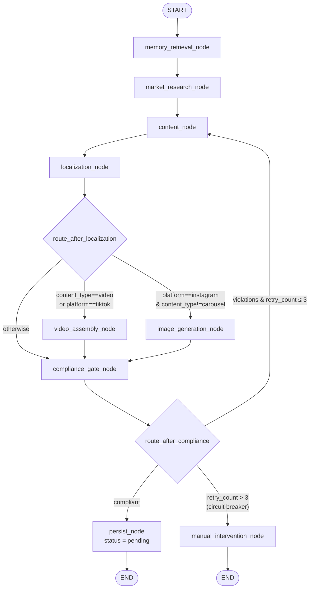
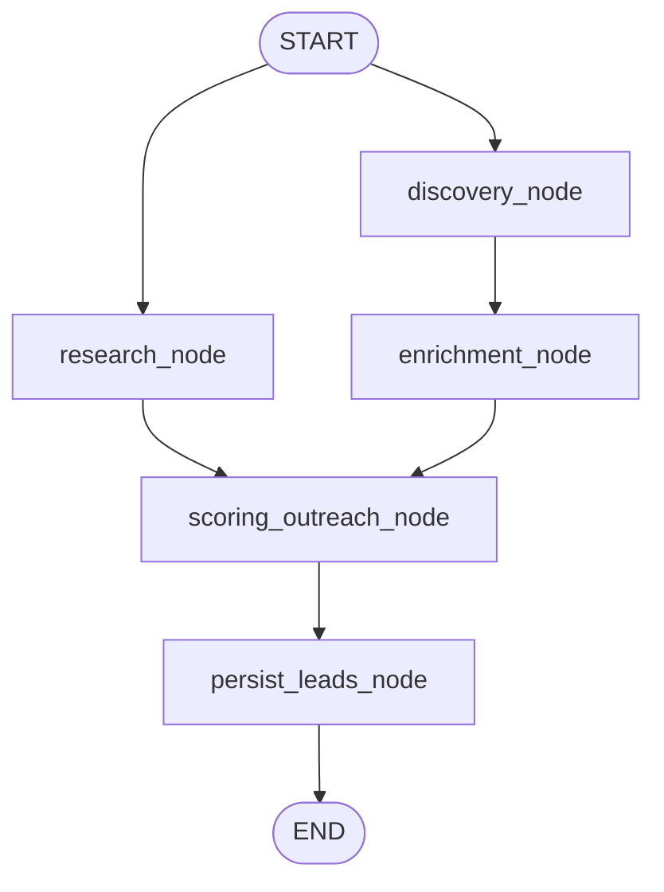
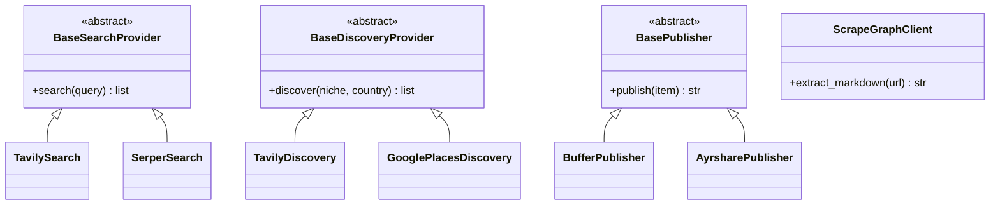
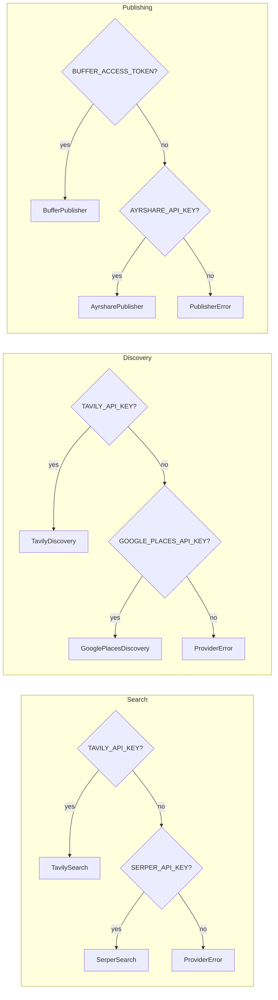
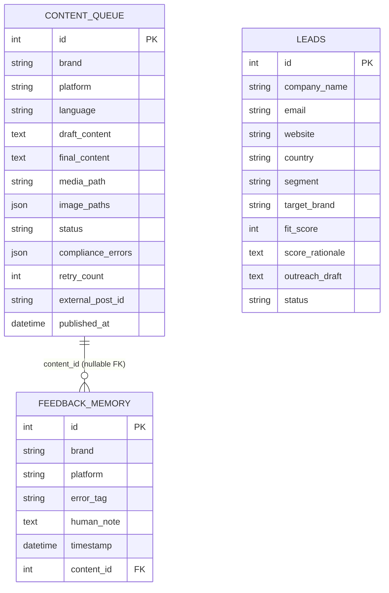
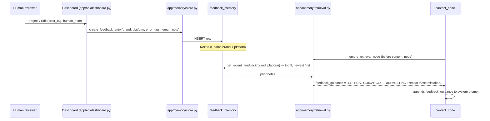
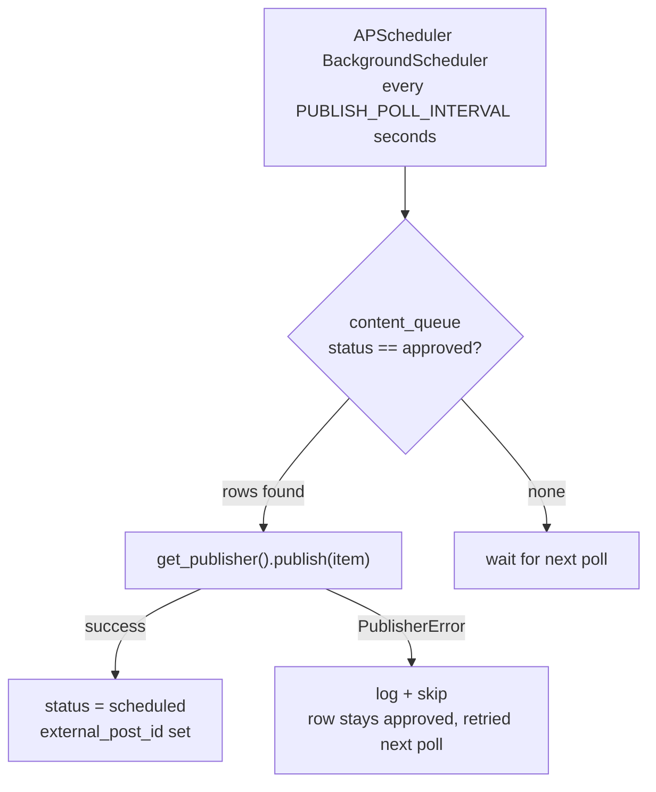
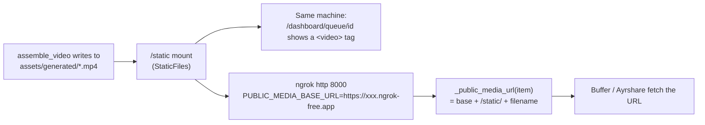

# Architecture

This document maps the system as it actually exists on `main` today (Phases
1–7), not the aspirational full design in `CLAUDE.md`. Where the two differ,
a note says so.

---

## 1. Content pipeline — the cyclic state machine (Project 1: the Brain)

`app/graph/graph.py`, state in `app/graph/state.py` (`MarketingState`). This
is the core LangGraph requirement: a **cyclic** graph, not a linear chain, so
a compliance failure can route back to content generation.

**Why it cycles back to `content_node`, not `memory_retrieval_node`:**
`memory_retrieval_node` and `market_research_node` each run once, before the
first draft. A retry already carries `compliance_errors` from the failed
attempt — that's injected directly into the rewrite prompt, which is a
sharper signal than re-fetching the same historical feedback again (and
avoids a second live research call per retry).

**Image vs. video routing:** `video_assembly_node` renders a reel for
`tiktok`, or any platform when `content_type=="video"` — internally,
`assemble_video()` (`app/media/assembly.py`) tries Veo first (real
generative video via the Gemini API, `app/llm/client.py::video_call`) and
falls back to script → `edge-tts` voiceover → `moviepy` assembly on any
failure (no key, no quota, timeout). `image_generation_node` renders a
single on-brand hero image via `image_call()` (`app/llm/client.py`), which
tries Gemini's native image-output models first and falls back to
Pollinations' free keyless API on any failure — confirmed live that
Gemini's free tier returns 429/limit=0 for every image model, so this
fallback is what actually produces images today, not a theoretical path.
Carousels are the one case
neither handles here: `build_format_pack`'s slide texts don't exist until
`persist_node` runs, so carousel images are generated there instead, one
per slide, after the pack is built. All three media paths follow the same
fail-open contract — a generation failure is logged and skipped, never
fabricated, and never blocks the text pipeline.

**Circuit breaker:** `route_after_compliance` (`app/graph/routing.py`) is the
only place retry policy lives. `retry_count` is incremented exclusively by
`compliance_gate_node`, never anywhere else. Past `settings.max_compliance_retries`
(default 3), the graph stops cycling and diverts to `manual_intervention_node`
instead of looping forever.

**Known gap:** `manual_intervention_node` is currently a logging-only terminal
node — it does not persist a row to `content_queue`. `CLAUDE.md`'s node
contract says it should. Rows only reach the manual-intervention dashboard
tab today via `scripts/seed_demo.py`, not via a live circuit-breaker trip.

---

## 2. Lead-gen pipeline — parallel fan-out/fan-in (Phase 5)

`app/graph/lead_gen_graph.py`, state in `app/graph/state.py` (`LeadGenState`).
A second, independent graph — research and discovery run **in parallel**
from `START`, and converge on scoring before persisting.

`research_node` and `enrichment_node` both hit external APIs and can each
fail independently; LangGraph runs `scoring_outreach_node` once both parallel
branches have completed, not before.

---

## 3. Swappable provider architecture (Phases 5 & 7)

Every external integration — search, place discovery, and social publishing —
follows the same shape: an abstract interface, two or more concrete
implementations, and a factory function that picks one **based on which
environment key is present**, never a hardcoded choice.

Selection logic (`app/agents/providers.py`, `worker/publisher.py`) — the
first configured key wins, checked in this fixed order:

Nothing in a node ever imports `httpx` or a vendor SDK for these directly —
they call `get_search_provider()` / `get_discovery_provider()` /
`get_publisher()` and work with whatever comes back.

---

## 4. Closed-loop feedback — database schema and the actual loop

Three tables, `app/db/models.py`:

This is the actual closed loop — the project's key differentiator — end to end:

Verified in `tests/test_phase6.py::test_rejection_is_retrievable_by_memory_engine` —
a rejection through the real HTTP route is immediately retrievable by
`get_recent_feedback()`, and demonstrated live with the pre-loaded history in
`scripts/seed_demo.py` (Jade/Instagram already carries a "too_salesy" note,
aligned with the seeded Jade/Instagram approved post so the retrieval is
visibly relevant to what's on screen).

---

## 5. Auto-publisher worker (Project 2, Phase 7)

`published` is deliberately **not** set here — it's reserved for a future
webhook confirmation step (not yet built) that the post actually went live.
Nothing publishes without a human approving it first: this worker only ever
reads rows a human already moved to `approved` via the dashboard.

---

## 6. Static media serving (Phase 8)

Generated media (`assets/generated/`) is mounted at `/static` in `app/main.py`
so it's servable both to a browser (the dashboard's detail-page video preview)
and to the publishing providers (Buffer/Ayrshare need a URL they can fetch,
not a local filesystem path).

`_media_url_for_display()` (`app/api/dashboard.py`) only embeds a `<video>`
tag when `media_path` resolves to something actually servable — either
already a `/static/...` path or a local file under `assets/generated/`. A
`media_path` from a different machine is shown as inert text instead of a
broken player.

Generated images (`image_paths`, JSON list) resolve the same way, via
`_image_urls()` in both `app/api/dashboard.py` and `app/api/actions.py` —
one hero shot for a post, one image per slide for a carousel.

